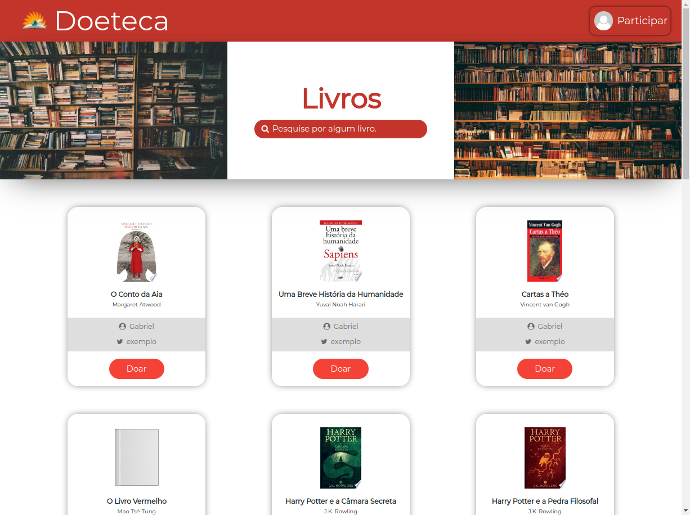
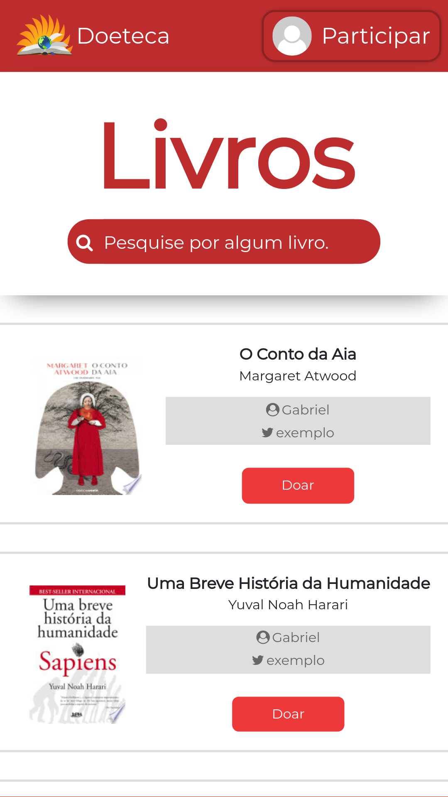

<p align="center">
  <a href="" rel="noopener">
 </a>
</p>

<h3 align="center">Doeteca Conceptual Frontend</h3>

<div align="center">

[]()
[](/LICENSE)

</div>

---

<p align="center"> ⚠ Under in Progress...
    <br> 
    Online on: https://davigsousa.github.io/doeteca
</p>

## 📝 Table of Contents

- [About](#about)
- [Getting Started](#getting_started)
- [Usage](#usage)
- [Built Using](#built_using)
- [Authors](#authors)
- [Screenshots](#screenshots)

## 🧐 About <a name = "about"></a>

Doeteca is a project created by me, to facilitate the book giveaway for everyone who need. So, to participate, you ask for a specific book e await for givers. <br>
Inspired on [Winnieteca](https://twitter.com/WinnieTeca). <br>
Then, I decided make this conceptual frontend project. Here, built on React and consuming a express api RESTful.

## 🏁 Getting Started <a name = "getting_started"></a>

These instructions will get you a copy of the project up and running on your local machine for development and testing purposes.

### Prerequisites

To make all easier, it's better you have Yarn. But, you can install everything with NPM too.

Yarn Official Website:
https://classic.yarnpkg.com/pt-BR/

### Installing

Open the project folder.
```
cd doeteca
```
Then, type:
```
yarn
```
or:
```
npm i
```
And you have finished it.

## 🎈 Usage <a name="usage"></a>

You can start the local version typing in root:
```
yarn start
```
or:
```
npm start
```

## ⛏️ Built Using <a name = "built_using"></a>

- [ReactJs](https://pt-br.reactjs.org/) - Web Framework
- [Express](https://expressjs.com/) - Server Framework
- [NodeJs](https://nodejs.org/en/) - Server Environment
- [Postgres](https://www.postgresql.org/) - Database

## ✍️ Authors <a name = "authors"></a>

- [@davigsousa](https://github.com/davigsousa) - Idea & Initial work

See also the list of [contributors](https://github.com/davigsousa/doeteca/contributors) who participated in this project.

## 📸 Screenshots <a name = "screenshots"></a>

Desktop:


Mobile:

